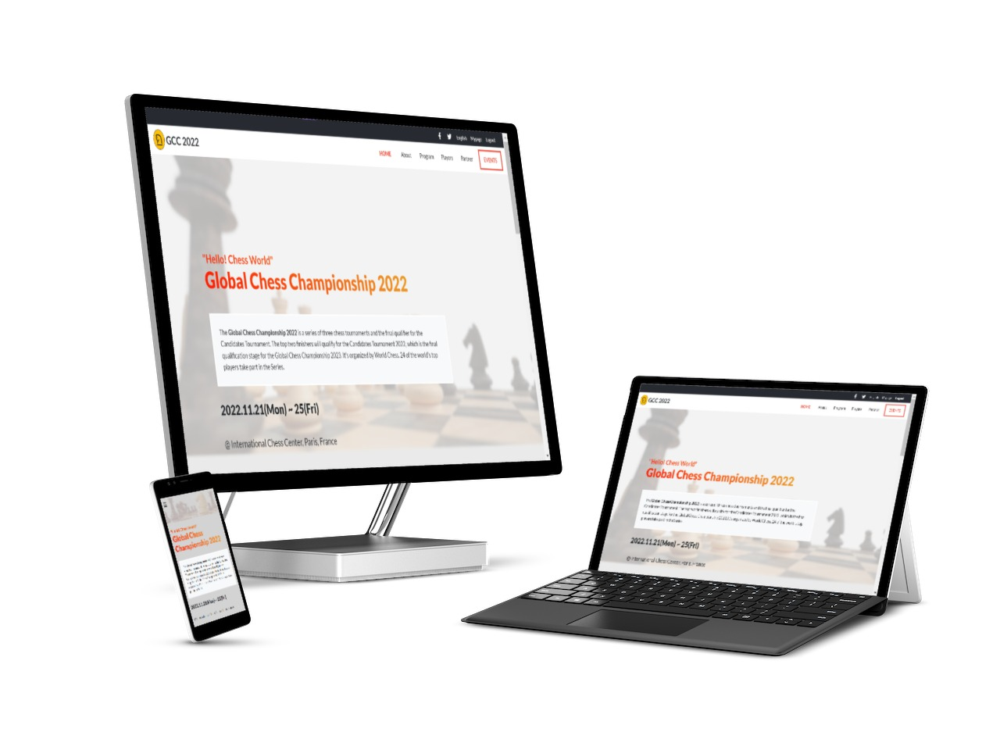

<a name="readme-top"></a>
[](https://www.codefactor.io/repository/github/indiecodermm/chessevent-site)
[](https://opensource.org/licenses/MIT)
<div align="center">

  
  <br/>

  <h3><b>Microverse Capstone Project - Module 1</b></h3>

</div>

# 📗 Table of Contents

- [📖 About the Project](#about-project)
  - [🛠 Built With](#built-with)
    - [Tech Stack](#tech-stack)
    - [Key Features](#key-features)
  - [🚀 Live Demo](#live-demo)
- [💻 Getting Started](#getting-started)
- [👥 Authors](#authors)
- [🔭 Future Features](#future-features)
- [🤝 Contributing](#contributing)
- [⭐️ Show your support](#support)
- [🙏 Acknowledgements](#acknowledgements)
- [📺 Presentation](#presentation)
- [📝 License](#license)

# ♟ Chess Event Website <a name="about-project"></a>

This is my capstone project for module 1 of Microverse program. In this project, I built a website for a chess tournaments, where people can see about the event, top players and other programs.



## 🛠 Built With <a name="built-with"></a>

### Tech Stack <a name="tech-stack"></a>

- HTML
- CSS
- JavaScript
- [Bootstrap 5](https://getbootstrap.com/)
- [Font Awesome](https://fontawesome.com/)
- [Lato Fonts](https://www.latofonts.com/) 


### Key Features <a name="key-features"></a>

- **Mobile-first Website**
- **Responsive Layout**
- **Dynamic Contents**

<p align="right">(<a href="#readme-top">back to top</a>)</p>

## 🚀 Live Demo <a name="live-demo"></a>

You can visit the live website on [GCC 2022 Website](https://indiecodermm.github.io/chessevent-site/).

<p align="right">(<a href="#readme-top">back to top</a>)</p>

## 💻 Getting Started <a name="getting-started"></a>

To get a local copy up and running, clone this repository to your desired folder using the following command:

```sh
  git clone git@github.com:IndieCoderMM/chessevent-site.git
```

<p align="right">(<a href="#readme-top">back to top</a>)</p>

<!-- AUTHORS -->

## 👨‍🚀 IndieCoderMM <a name="authors"></a>

- GitHub: [@IndieCoderMM](https://github.com/IndieCoderMM)
- Twitter: [@heinThantO](https://twitter.com/heinThantO)
- LinkedIn: [hthantoo](https://www.linkedin.com/in/hthantoo)

<p align="right">(<a href="#readme-top">back to top</a>)</p>

## 🔭 Future Features <a name="future-features"></a>

- [ ] **Add dynamic button for mobile**
- [ ] **Add form for ordering tickets**
- [ ] **Create ranking table of top players**

<p align="right">(<a href="#readme-top">back to top</a>)</p>

## 🤝 Contributing <a name="contributing"></a>

Contributions, issues, and feature requests are welcome!

Feel free to check the [issues page](../../issues/).

<p align="right">(<a href="#readme-top">back to top</a>)</p>

<!-- SUPPORT -->

## ⭐️ Show your support <a name="support"></a>

If you like this project, you can support me by giving a ⭐.

<p align="right">(<a href="#readme-top">back to top</a>)</p>

## 🙏 Acknowledgments <a name="acknowledgements"></a>

The design inspiration of this project is from [CC Global Summit 2015](https://www.behance.net/gallery/29845175/CC-Global-Summit-2015/modules/192118207) created by [Cindy Shin in Behance](https://www.behance.net/adagio07).

I would like to thank all of the code reviewers for making my project better.

<p align="right">(<a href="#readme-top">back to top</a>)</p>

## 📺 Presentation <a name="presentation"></a>

You can watch my [presentation about this project here](https://www.loom.com/share/f776c2ee38fe487b89b186001d697429).

<p align="right">(<a href="#readme-top">back to top</a>)</p>

## 📝 License <a name="license"></a>

This project is [MIT](./MIT.md) licensed.

<p align="right">(<a href="#readme-top">back to top</a>)</p>
